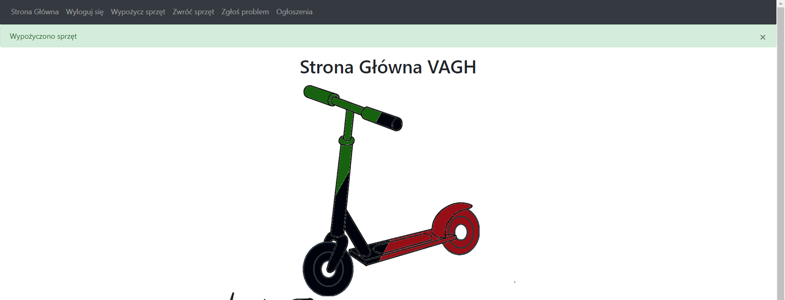
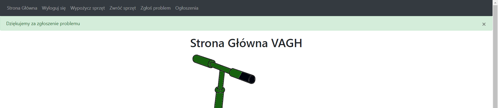

# _MS Vehicle AGH - instrukcja użytkownika_
<<<<<<< FINAL

<b> 1. Uruchomienie aplikacji </b>

Aktualnie aplikacja uruchamiana jest lokalnie. Po uruchomieniu terminala należy wpisać „python […]/main.py” (gdzie […]
to lokalizacja pliku main.py (docelowo w plikach projektu)) w celu uruchomienia aplikacji. Następnie pojawi się
komunikat, w którym będzie widniał link do skopiowania: http://127.0.0.1:5000/. Należy skopiować go i wkleić w
przeglądarce internetowej. Użytkownik zostanie przekierowany na stronę aplikacji.  
<b> 2. Logowanie oraz rejestracja </b>  

W celu zalogowania się, użytkownik powinien wpisać poprawnie dane lub
zarejestrować się.

Rejestracja wymaga poprawności wprowadzanych danych.

<b> 3. Strona główna </b>

Po zalogowaniu się użytkownik zostanie przekierowany na stronę główną.

<b> 4. Wypożyczenie sprzętu </b>

W celu wypożyczenia sprzętu należy wcisnąć przycisk "Wypożycz sprzęt". Następnie należy wybrać rodzaj sprzętu oraz 
lokalizację.

<b> 5. Zwrot sprzętu </b>

W celu zwrócenia sprzętu należy wcisnąć przycisk "Zwróć sprzęt", a następnie wybrać lokalizację, w ktorej sprzęt zostaje
pozostawiony.

Nie można zwrócić sprzętu, jeśli żadnego się nie wypożyczyło.

<b> 6. Ogłoszenia </b>

W celu sprawdzenia ogłoszeń należy wcisnąć przycisk "Ogłoszenia".

<b> 7. Zgłaszanie problemu </b>

W celu zgłoszenia usterki należy wcisnąć przycisk "Zgłoś problem". Należy wpisać zgłoszenie a następnie kliknąć "Wyślij 
zgłoszenie". Uwaga, zgłoszenie nie może być puste.

<b> 8. Wylogowanie </b>

Aby wylogować się należy wcisnąć przycisk "Wyloguj się".

=======
<b> 1. Uruchomienie aplikacji </b>

Aktualnie aplikacja uruchamiana jest lokalnie. Po uruchomieniu terminala należy wpisać „python […]/main.py” (gdzie […] to lokalizacja pliku main.py (docelowo w plikach projektu)) w celu uruchomienia aplikacji. Następnie pojawi się komunikat, w którym będzie widniał link do skopiowania: http://127.0.0.1:5000/. Należy skopiować go i wkleić w przeglądarce internetowej. Użytkownik zostanie przekierowany na stronę aplikacji.  
<b> 2. Logowanie oraz rejestracja
>>>>>>> main
